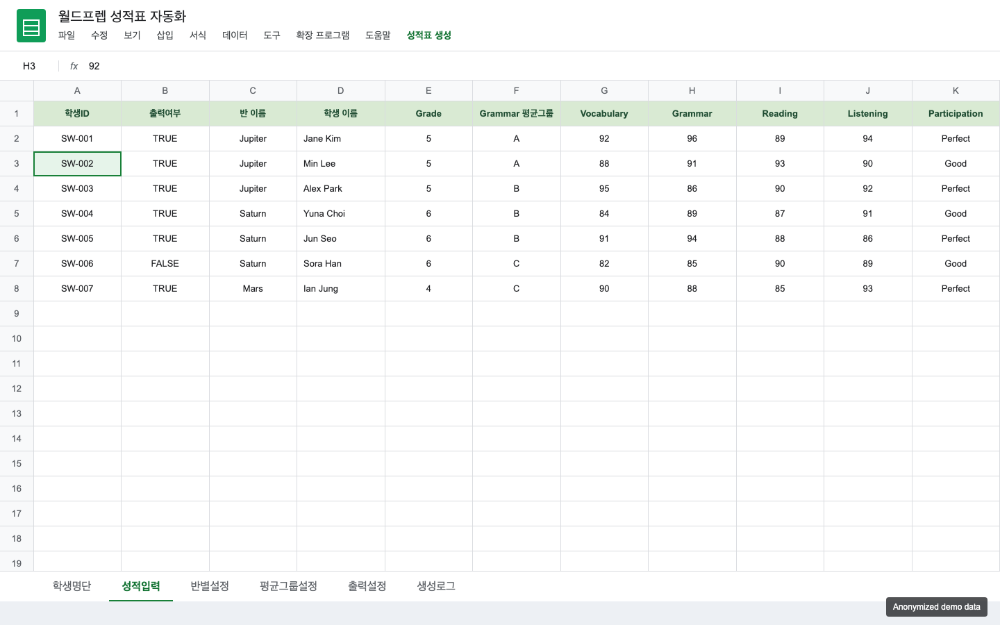
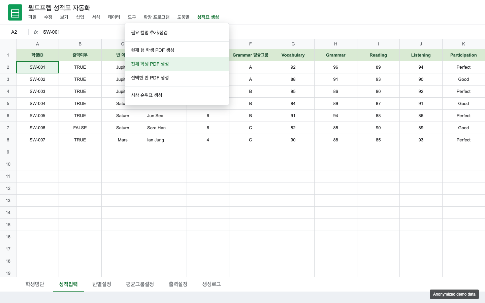
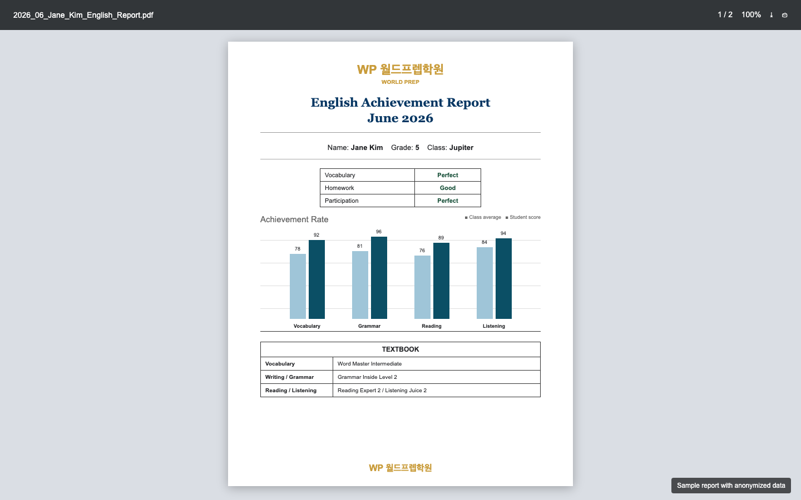
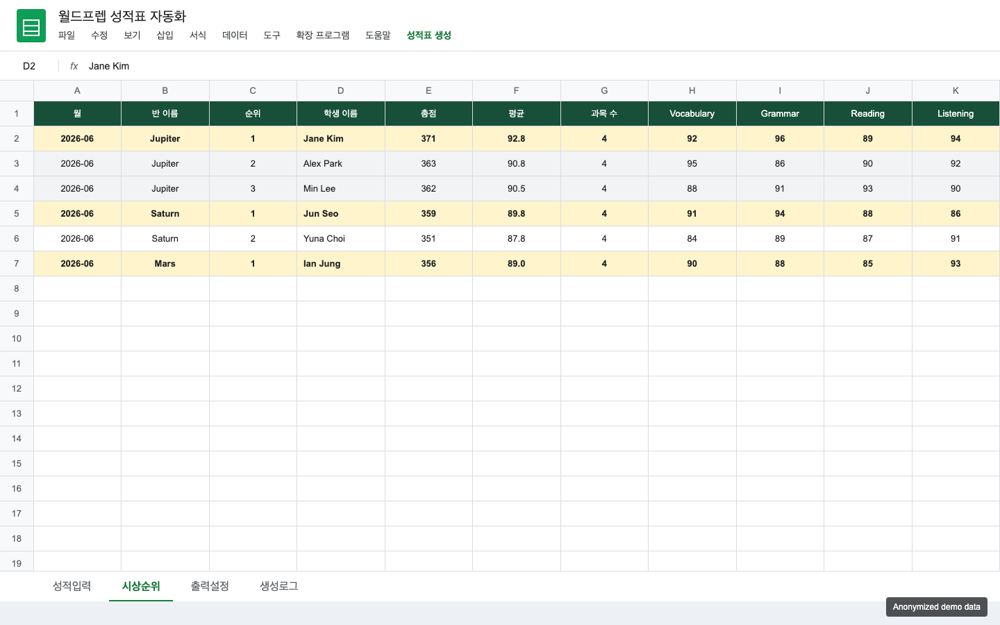
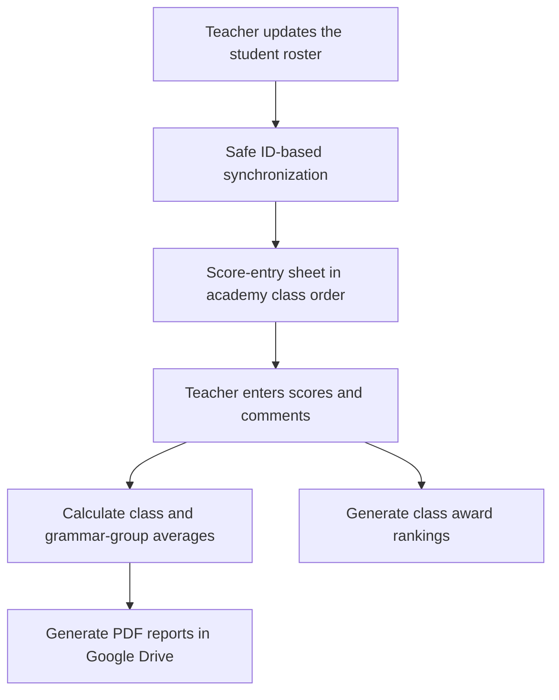

# English Academy Report Automation

A Google Apps Script system that turns an academy's existing Google Sheets workflow into a safer report-card pipeline, from roster management and score entry to PDF generation and award rankings.

## System at a Glance

| Score Input Sheet | Report Generation Menu |
|:---:|:---:|
|  |  |
| **Generated PDF Report Card** | **Automated Award Ranking Sheet** |
|  |  |

_All screens use anonymized demonstration data. No real student information is shown._

## Automation Workflow



## Project Background

I joined an elementary English academy as an assistant English instructor during my university break. The academy was preparing student report cards, comments, average comparisons, and award rankings manually.

Even in a part-time role, I try to look beyond the task immediately in front of me and understand the wider workflow. I ask questions such as:

- Why is this work performed this way?
- How much time is being spent on repetitive tasks?
- As staff fatigue accumulates, how do errors and service quality change?
- How might those changes affect parent satisfaction, student re-enrollment, and academy revenue?
- How much time and cost could be saved by introducing the right technology?

From this perspective, manual report-card preparation was more than an inconvenient routine. I believed that repeated administrative work could increase teacher fatigue and the likelihood of mistakes, eventually affecting the quality of service delivered to parents and students.

Rather than replacing tools the staff already knew, I kept the academy's existing Google Sheets environment and automated report generation, average calculations, and award rankings with Google Apps Script. This lightweight approach reduced repetitive work without requiring a separate application or paid system.

This project was built to help teachers generate report cards faster, reduce manual calculation work, and make student award rankings immediately available after entering scores.

## What This System Does

- Synchronizes roster additions, edits, moves, and removals with the score-entry sheet
- Uses stable student IDs so data follows the student rather than a visual row position
- Protects entered scores, comments, notes, and formulas when a roster match is uncertain
- Keeps both operational sheets in the academy's class sequence: Beginner, Pre-Inter, Advanced, and PowerStation
- Preserves existing Google Sheets dropdown styling during routine synchronization
- Generates individual PDF report cards from Google Sheets data
- Supports 2-subject and 4-subject report formats automatically
- Compares each student's score with the relevant class or grammar-group average
- Separates grammar average groups from regular class averages
- Creates a second-page teacher comment table by subject
- Uses dropdowns for repeated inputs such as class names, grammar groups, and learning attitude ratings
- Allows report title, output month, folder name, and file naming rules to be changed from a settings sheet
- Creates a class-by-class award ranking sheet sorted by total score
- Logs generated PDF results and Drive links

## Main Workflow

1. Staff maintain class defaults in `반별설정` and students in `학생명단`.
2. Roster changes are synchronized automatically to `성적입력`; a manual sync menu remains as a recovery option.
3. Teachers enter scores, ratings, and comments in `성적입력`.
4. The menu `성적표 생성 > 필요 기능 추가/점검` validates the sheet structure and installs the required trigger.
5. Teachers generate one student's PDF or all rows marked for output.
6. The system saves reports to Google Drive and records the result in `생성로그`.
7. Teachers generate `시상순위` directly from the completed score data.

## Key Features

### Report Card PDF Generation

The PDF template is built with Apps Script HTML templates. Each report includes:

- Academy logo
- Student name, grade, and class
- Learning attitude table
- Achievement chart comparing student score and average score
- Textbook information
- Subject-specific teacher comments on page 2

### Average Comparison Logic

The system calculates averages by configurable groups:

- Reading, Writing, and Listening/Speaking use class-based averages
- Grammar can use a separate `Grammar 평균그룹`, such as `A`, `B`, or `C`

This reflects the academy's real teaching structure, where grammar classes may not always match the main class name.

### Award Ranking Automation

The `시상순위` sheet is generated automatically from entered scores. It shows:

- Month
- Class name
- Rank
- Student name
- Total score
- Average score
- Number of subjects entered
- Scores by subject

Students are grouped by class and sorted from highest to lowest total score. Ties receive the same rank.

### Admin-Friendly Settings

Teachers can update operational data without editing code:

- `반별설정`: active class list and class-related defaults
- `출력설정`: report title, output month, folder name, and file name rule

### Roster Synchronization and Data Safety

The roster and score-entry sheet are intentionally separated: staff manage identity and class placement in `학생명단`, while teachers work with assessment data in `성적입력`.

The synchronization layer makes that separation reliable:

- A hidden `학생ID` is assigned once and used as the primary match key.
- Existing score rows are updated in place, preserving assessment data.
- New roster students receive score rows and class-level textbook defaults.
- Removed students are cleared automatically only when no protected assessment data exists.
- If scores, comments, notes, or formulas would be orphaned, synchronization stops and identifies the rows that require review.
- A document lock prevents overlapping automatic and manual synchronization runs.

### Operational Class Ordering

Both `학생명단` and `성적입력` use the same normalized class order:

```text
Beginner 1-4
Pre-Inter 1-4
Advanced 1-4
PowerStation 1-2
```

Spaces, hyphens, and capitalization are normalized for comparison. Blank separator rows are inserted between class groups without making row position part of student identity.

## Technology

- Google Apps Script
- Google Sheets
- HTML/CSS for PDF templates
- Google Drive PDF export
- OpenAI Responses API for optional teacher-comment polishing
- Script Properties for API-key storage
- Installable spreadsheet triggers and Apps Script locking

## Files

- `Code.gs`: synchronization, data safeguards, menus, PDF generation, averages, AI comments, and ranking logic
- `ReportTemplate.html`: HTML/CSS template for the PDF report card
- `PORTFOLIO_CASE_STUDY.md`: detailed problem-solving and iteration record
- `업데이트_이용방법.md`: operational setup guide for applying updates in Apps Script
- `appsscript.json`: V8 runtime, timezone, and required OAuth scopes

## Engineering Journey

### 1. Replacing Row-Position Assumptions with Stable Identity

An early cleanup routine revealed that spreadsheet row positions are not reliable identities. Rows move whenever classes are sorted or separator rows are inserted, so a position-based update could associate assessment data with the wrong student.

I redesigned the model around hidden, persistent student IDs. Legacy rows are backfilled only when a unique visible match or unique name makes the association safe. This changed the synchronization contract from "same row" to "same student."

### 2. Making Deletion Conservative

A roster deletion should remove an unused score row, but it should never silently erase completed assessment work. I separated class defaults from protected score data and added checks for values, cell notes, and formulas. Clean rows can be removed automatically; rows containing teacher work stop the sync and produce a review list.

### 3. Fixing a Dropdown-Color Regression

An intermediate version refreshed data-validation rules during every sync. In Google Sheets, that also rebuilt the dropdown presentation and turned carefully assigned class colors white. I traced the problem to synchronization doing two unrelated jobs: moving data and rebuilding UI rules.

The final version isolates routine roster synchronization from validation-rule setup. Automatic change handling responds only to structural membership changes, while formatting events are ignored. Dropdown setup remains an explicit maintenance operation, so class colors survive normal roster edits.

### 4. Creating a Deterministic Academy Class Order

Alphabetical sorting placed `PowerStation` before `Pre-Inter` and did not match the academy's teaching progression. I introduced an explicit domain order and a normalization function that handles variants such as `Pre-Inter 1`, `Pre-Inter1`, and differences in capitalization. The score sheet then mirrors the roster order through student IDs.

The detailed iteration record is available in [PORTFOLIO_CASE_STUDY.md](PORTFOLIO_CASE_STUDY.md).

## Impact

This project converted a manual report-card workflow into a repeatable automation process. It helped teachers:

- Reduce repetitive data entry and calculation work
- Maintain one roster source without manually copying changes into the score sheet
- Generate report cards more quickly
- Avoid manual average and ranking mistakes
- Produce consistent PDF designs
- Protect existing teacher input during roster changes and class reordering
- Prepare award rankings immediately after entering scores

The project is a practical example of applying AI-era tooling and automation thinking to a real workplace problem, even outside a formal software engineering role.

## User Feedback and Workplace Recognition

After introducing the system, I conducted short feedback check-ins with the academy director and teachers. I asked whether the tool was easy to use, which features were most helpful, whether it reduced the inconvenience of the previous workflow, what additional features they needed, and whether they intended to keep using it.

The feedback was consistently positive. The staff recognized that the system reduced repetitive work and made the report-card process easier to manage, while the conversations also gave me practical direction for future improvements.

The response went beyond positive comments about the tool. Less than one month after I started working at the academy, I was asked whether I would consider moving beyond the part-time role and joining as a regular staff member. I was also asked whether I would be willing to take on future outsourced automation work for the academy. For me, this was meaningful evidence that proactively identifying an operational problem and delivering a usable solution could build trust quickly, even without holding a formal software position.

## Privacy Note

This repository contains the automation code and template only. Real student data, generated PDFs, and private Google Sheet contents should not be committed.
