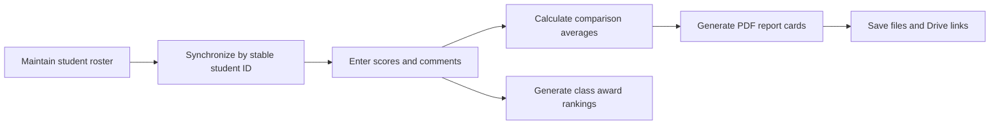

# English Academy Report-Card Automation

> A workplace automation project that reduced a report-card cycle for more than 200 elementary students from over two weeks of manual work to roughly one working day.

Built with Google Sheets, Google Apps Script, HTML/CSS, and Google Drive PDF export.

## At a Glance

| Score-entry workflow | Report-generation menu |
|:---:|:---:|
|  |  |
| **Generated report card** | **Automated award ranking** |
|  |  |

_All screenshots contain anonymized demonstration data. No real student information is included in this repository._

## Why I Built It

I began working as an assistant English instructor at an elementary English academy during the summer break of my third year at university. I was hired to support lessons, not to develop software. Soon after joining, however, I saw the staff preparing a major reporting cycle for more than 200 students.

The existing process was almost entirely manual. Staff entered each student's information and scores across four or more subjects, calculated class averages, wrote a teacher comment for every subject, assembled the reports, and prepared award rankings. The reports also had a fixed deadline because they had to be delivered to parents. Teaching children during the day while completing hundreds of repetitive, accuracy-sensitive records created visible fatigue and pressure.

The turning point was hearing both sides of the problem. The employees were discouraged by the volume of work, while the academy director explained that the reports still had to be completed and there was no obvious alternative. I wondered whether AI-assisted development and lightweight automation could ease that conflict: less administrative fatigue for teachers, more attention for students, and a more consistent service for parents. I also felt genuinely excited that, as a university student with only a few months of coding experience, I had found a real operational problem where I could test whether technology could create practical value.

I proposed the idea to the director and received permission to develop it. Because coding was outside my assigned working hours, I continued building and improving the system in my own time. My aim was not merely to produce one batch of reports. I wanted to leave behind a tool that the academy could continue to operate without a developer.

## From Manual Work to an Operational System

The academy already relied on Google Sheets, so replacing its workflow with an unfamiliar application would have added training and adoption costs. I kept the interface that staff already knew and used Apps Script as the automation layer.

The system now:

- synchronizes roster additions, edits, class moves, and safe removals;
- preserves scores and comments by matching stable student IDs rather than row positions;
- supports two-subject and four-subject report formats;
- calculates class averages and separate grammar-group averages;
- produces individual two-page PDF report cards;
- generates award rankings by class, including tie handling;
- stores configurable report titles, months, folders, and file-naming rules;
- logs output status and Google Drive links; and
- keeps routine administration inside familiar spreadsheet menus.

## My Role and Ownership

I identified the opportunity, proposed the project, translated the academy's workflow into requirements, designed the operating logic, tested the output, and iterated on the system. I also anticipated needs that had not been formally requested. The automatic award-ranking feature, for example, came from asking what the director would need immediately after all scores had been entered.

This project was created early in my programming journey. I had been learning to code for about three months and had never built an Apps Script system before. I therefore used AI extensively to help draft and revise code. My responsibility was to define the problem precisely, break the workflow into workable rules, provide useful instructions and constraints, read through the generated code, test it against real scenarios, identify regressions, and decide whether each change was safe for the existing system.

I do not present AI-generated code as evidence that I wrote every line unaided. The work I claim is the end-to-end ownership required to turn generated code into a functioning workplace tool: requirements discovery, workflow design, iterative validation, error diagnosis, user-centered decisions, and operational delivery.

## Engineering Challenges

### Student identity could not depend on row position

Spreadsheet rows move when staff sort classes or insert separators. An early position-based approach could therefore associate assessment data with the wrong student. I redesigned the synchronization model around hidden, persistent student IDs. Visible order can now change without changing identity.

### Automation had to refuse unsafe deletions

A student removed from the roster may still have completed scores, comments, notes, or formulas. Instead of silently deleting such work, the system removes only clean rows automatically and stops with a review list when protected data may be orphaned.

### Fixing one feature could break another

The most demanding part of development was not producing an isolated feature. It was maintaining the behavior of the whole system while changing one mechanism. A change that fixed feature A could disrupt B; repairing C could reintroduce an earlier error in A. I learned to test changes as regressions across the workflow rather than treating each successful output as proof that the system was complete.

One example involved dropdown colors. Rebuilding validation rules during synchronization preserved the underlying values but erased visual class cues used by staff. I separated routine roster synchronization from interface setup so operational updates no longer rebuild dropdown presentation.

### The academy's class order was not alphabetical

Generic sorting did not match the curriculum progression. I encoded the domain order explicitly and normalized differences in spaces, hyphens, and capitalization before sorting.

More detail on these iterations is available in [PORTFOLIO_CASE_STUDY.md](PORTFOLIO_CASE_STUDY.md).

## Outcome

The previous report-card cycle took more than two weeks of manual effort. The completed workflow made it possible to handle the core process within approximately one working day. This is an operational before-and-after estimate from the workplace, not a controlled performance benchmark.

The response from the academy was immediate. Staff jokingly called me a “wizard” and a “magician,” but the more meaningful result was their trust in the system. The director said the academy intended to continue using it and asked whether future automation work could be commissioned from me externally. I was also invited to consider taking on a larger role at the academy less than a month after joining.

For me, that recognition mattered because I had not approached the job with the boundary of “this is only my assigned task.” I had instinctively looked at the operation as a whole, felt responsible for a problem affecting other people, and tried to create a durable solution. The experience showed me that I am most engaged when I can notice an overlooked problem, take ownership, and improve how an organization works.

## What I Learned

- Useful automation begins with understanding people and workflow, not choosing a technology.
- A spreadsheet used by many people is a small information system and needs data-integrity safeguards.
- AI can accelerate implementation, but it does not replace requirement definition, verification, or responsibility for the result.
- Anticipating the next user need can turn a one-time script into a more complete service.
- Technical ability grows fastest when a real user depends on the outcome.

## Technology

- Google Apps Script and Google Sheets
- HTML/CSS templates
- Google Drive PDF export
- Installable spreadsheet triggers and document locking
- OpenAI Responses API for optional comment polishing
- Script Properties for secret storage

## Repository Guide

- [`Code.gs`](Code.gs): menus, roster synchronization, safeguards, averages, PDF generation, optional AI comment polishing, and ranking logic
- [`ReportTemplate.html`](ReportTemplate.html): the two-page report-card template
- [`PORTFOLIO_CASE_STUDY.md`](PORTFOLIO_CASE_STUDY.md): detailed engineering iterations and decisions
- [`업데이트_이용방법.md`](업데이트_이용방법.md): Korean-language handoff guide for the academy staff who operate the system
- [`appsscript.json`](appsscript.json): runtime, timezone, and OAuth configuration

## Privacy and Responsible Use

The public repository contains code, templates, and anonymized demonstrations only. Real names, scores, teacher comments, generated reports, API keys, and private Google Sheet contents are excluded. AI-based comment polishing is optional, and secrets are stored in Script Properties rather than source code.
