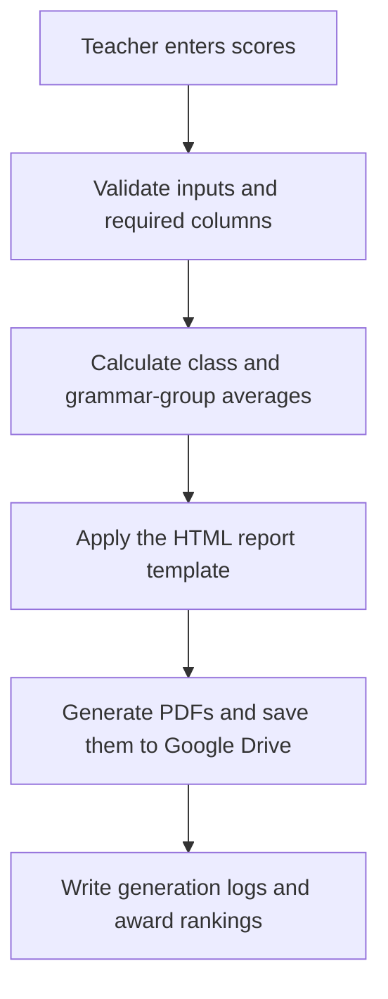

# English Academy Report Automation

Google Apps Script based automation system for generating English academy report cards and award rankings from Google Sheets.

## System at a Glance

| Score Input Sheet | Report Generation Menu |
|:---:|:---:|
|  |  |
| **Generated PDF Report Card** | **Automated Award Ranking Sheet** |
|  |  |

_All screens use anonymized demonstration data. No real student information is shown._

## Automation Workflow

## Project Background

I joined an elementary English academy as an assistant English instructor during my university break. The academy was preparing student report cards, comments, average comparisons, and award rankings manually.

Even in a part-time role, I try to look beyond the task immediately in front of me and understand the wider workflow. I ask questions such as:

- Why is this work performed this way?
- How much time is being spent on repetitive tasks?
- As staff fatigue accumulates, how do errors and service quality change?
- How might those changes affect parent satisfaction, student re-enrollment, and academy revenue?
- How much time and cost could be saved by introducing the right technology?

From this perspective, manual report-card preparation was more than an inconvenient routine. I believed that repeated administrative work could increase teacher fatigue and the likelihood of mistakes, eventually affecting the quality of service delivered to parents and students.

Rather than replacing tools the staff already knew, I kept the academy's existing Google Sheets environment and automated report generation, average calculations, and award rankings with Google Apps Script. This lightweight approach reduced repetitive work without requiring a separate application or paid system.

This project was built to help teachers generate report cards faster, reduce manual calculation work, and make student award rankings immediately available after entering scores.

## What This System Does

- Generates individual PDF report cards from Google Sheets data
- Supports 2-subject and 4-subject report formats automatically
- Compares each student's score with the relevant class or grammar-group average
- Separates grammar average groups from regular class averages
- Creates a second-page teacher comment table by subject
- Uses dropdowns for repeated inputs such as class names, grammar groups, and learning attitude ratings
- Allows report title, output month, folder name, and file naming rules to be changed from a settings sheet
- Creates a class-by-class award ranking sheet sorted by total score
- Logs generated PDF results and Drive links

## Main Workflow

1. Teachers enter scores and comments in the `성적입력` sheet.
2. The menu `성적표 생성 > 필요 컬럼 추가/점검` checks and prepares required columns.
3. Teachers generate PDFs for one student, all students, or a selected class.
4. The system creates PDF report cards in a Google Drive folder.
5. Teachers run `성적표 생성 > 시상 순위표 생성` to create class-by-class rankings for awards.

## Key Features

### Report Card PDF Generation

The PDF template is built with Apps Script HTML templates. Each report includes:

- Academy logo
- Student name, grade, and class
- Learning attitude table
- Achievement chart comparing student score and average score
- Textbook information
- Subject-specific teacher comments on page 2

### Average Comparison Logic

The system calculates averages by configurable groups:

- Reading, Writing, and Listening/Speaking use class-based averages
- Grammar can use a separate `Grammar 평균그룹`, such as `A`, `B`, or `C`

This reflects the academy's real teaching structure, where grammar classes may not always match the main class name.

### Award Ranking Automation

The `시상순위` sheet is generated automatically from entered scores. It shows:

- Month
- Class name
- Rank
- Student name
- Total score
- Average score
- Number of subjects entered
- Scores by subject

Students are grouped by class and sorted from highest to lowest total score. Ties receive the same rank.

### Admin-Friendly Settings

Teachers can update operational data without editing code:

- `반별설정`: active class list and class-related defaults
- `평균그룹설정`: average calculation rules
- `출력설정`: report title, output month, folder name, and file name rule

## Technology

- Google Apps Script
- Google Sheets
- HTML/CSS for PDF templates
- Google Drive PDF export

## Files

- `Code.gs`: Apps Script logic for menus, sheet setup, PDF generation, average calculation, and award ranking
- `ReportTemplate.html`: HTML/CSS template for the PDF report card
- `업데이트_이용방법.md`: operational setup guide for applying updates in Apps Script

## Engineering Challenge and Recovery

An early version exposed an important data-integrity issue: while cleaning up blank rows, some student records disappeared from the working sheet. The underlying problem was that the original logic relied too heavily on row positions, even though those positions could change whenever rows were reorganized.

I treated this as a development and recovery problem rather than hiding it. I revised the synchronization logic to identify students using stable student IDs, validate the result against the original roster, and restore matched student data instead of assuming that the same row still represented the same person. This experience strengthened the system's safeguards and reinforced the importance of designing spreadsheet automation around data identity rather than visual row order.

## Impact

This project converted a manual report-card workflow into a repeatable automation process. It helped teachers:

- Reduce repetitive data entry and calculation work
- Generate report cards more quickly
- Avoid manual average and ranking mistakes
- Produce consistent PDF designs
- Prepare award rankings immediately after entering scores

The project is a practical example of applying AI-era tooling and automation thinking to a real workplace problem, even outside a formal software engineering role.

## User Feedback and Workplace Recognition

After introducing the system, I conducted short feedback check-ins with the academy director and teachers. I asked whether the tool was easy to use, which features were most helpful, whether it reduced the inconvenience of the previous workflow, what additional features they needed, and whether they intended to keep using it.

The feedback was consistently positive. The staff recognized that the system reduced repetitive work and made the report-card process easier to manage, while the conversations also gave me practical direction for future improvements.

The response went beyond positive comments about the tool. Less than one month after I started working at the academy, I was asked whether I would consider moving beyond the part-time role and joining as a regular staff member. I was also asked whether I would be willing to take on future outsourced automation work for the academy. For me, this was meaningful evidence that proactively identifying an operational problem and delivering a usable solution could build trust quickly, even without holding a formal software position.

## Privacy Note

This repository contains the automation code and template only. Real student data, generated PDFs, and private Google Sheet contents should not be committed.
